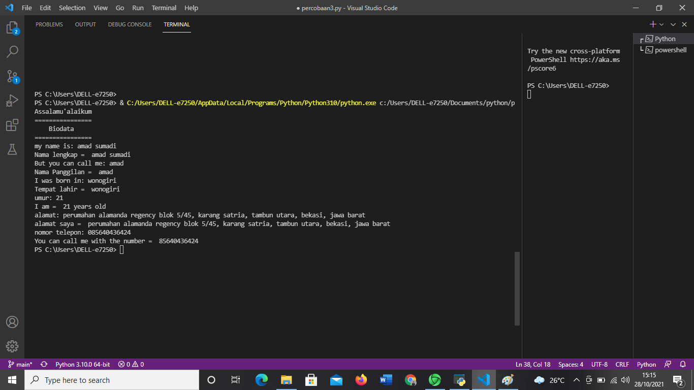

# tugaske2
## Belajar membuat perkenalan singkat pada python

### membuat perkenalan singkat
pada slide ini kita akan belajar membuat perkenalan singkat
untuk membuatnya saya menggunakan 2 aplikasi 
yaitu dengan aplikasi python dan aplikasi visual studio
ini adalah tampilannya

dan ini adalah output dari perintah yang kita masukkan tadi

